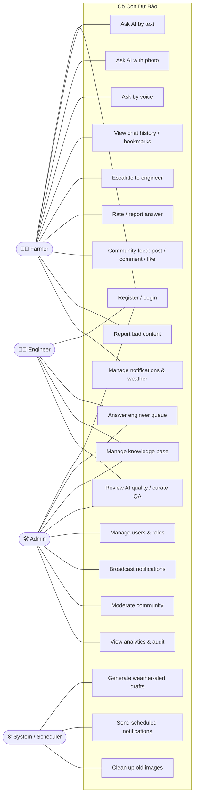

# Software Requirements Specification (SRS) — Cò Con Dự Báo

| Field | Value |
|---|---|
| **Document** | 02 — Software Requirements Specification |
| **Standard** | Structured after IEEE 830 |
| **Version** | 1.0.0 |
| **Status** | Baseline (as-built @ 2026-06-30) |
| **Related** | [01-PROJECT-CHARTER](01-PROJECT-CHARTER.md) · [03-ARCHITECTURE](03-ARCHITECTURE.md) · [05-API](05-API.md) · [06-TEST-PLAN](06-TEST-PLAN.md) |

> This SRS is written **as-built**: every functional requirement corresponds to behavior
> that exists in the codebase, so it doubles as a verifiable specification. Requirement
> IDs are referenced by the [Test Plan](06-TEST-PLAN.md) and [API Reference](05-API.md).

---

## Table of contents

1. [Introduction](#1-introduction)
2. [Overall description](#2-overall-description)
3. [Actors & use cases](#3-actors--use-cases)
4. [Functional requirements](#4-functional-requirements)
5. [External interface requirements](#5-external-interface-requirements)
6. [Non-functional requirements](#6-non-functional-requirements)
7. [Data requirements](#7-data-requirements)
8. [Assumptions, dependencies & constraints](#8-assumptions-dependencies--constraints)
9. [Requirement traceability](#9-requirement-traceability)

---

## 1. Introduction

### 1.1 Purpose
Specify the functional and non-functional requirements of **Cò Con Dự Báo**, a
Progressive Web App that provides AI-assisted agricultural advice to farmers in Trường
Khánh commune (Sóc Trăng, Vietnam), with human agronomist escalation and administrative
tooling.

### 1.2 Scope
The product lets farmers ask agronomy questions (text/voice/photo) and receive answers
from a RAG pipeline grounded in a curated knowledge base; routes low-confidence questions
to engineers; supports a community feed, broadcast & weather notifications, and weather
information; and provides admin tools for user management, content moderation, knowledge
curation, and analytics. Out of scope: e-commerce, payments, IoT/sensor integration,
native mobile apps, and multi-tenant/multi-commune deployment (see [Charter](01-PROJECT-CHARTER.md)).

### 1.3 Definitions & abbreviations

| Term | Meaning |
|------|---------|
| **RAG** | Retrieval-Augmented Generation — retrieve knowledge chunks, then have an LLM answer grounded in them |
| **PWA** | Progressive Web App (installable, offline-capable web app) |
| **Curated QA / `qa_direct`** | A human-authored Q&A served verbatim when retrieval is highly similar |
| **Escalation** | Routing a question to a human engineer |
| **Confidence** | Top retrieval cosine similarity, used to decide answer path |
| **Engineer** | An agronomist user who answers escalated questions and curates knowledge |
| **JWT / RBAC / RLS** | JSON Web Token / Role-Based Access Control / Row-Level Security |
| **Quiet hours** | A per-device window during which push notifications are suppressed |

### 1.4 References
[Project Charter](01-PROJECT-CHARTER.md), [Architecture/SDD](03-ARCHITECTURE.md),
[Database](04-DATABASE.md), [API](05-API.md), [Test Plan](06-TEST-PLAN.md),
[Risk Register](07-RISK-REGISTER.md), [Operations](../OPERATIONS.md),
user manuals in `docs/HUONG-DAN-*.md`.

---

## 2. Overall description

### 2.1 Product perspective
A new, self-contained system composed of a React PWA, an Express REST API, and a Supabase
(Postgres + pgvector + Storage) backend, integrating Google Gemini (AI), Open-Meteo
(weather), Twilio via Supabase Auth (OTP), and browser push services. See
[Architecture §3–4](03-ARCHITECTURE.md#3-system-context-c4-level-1).

### 2.2 Product functions (summary)
- AI question answering (text, photo, voice) with human escalation.
- Knowledge-base ingestion and curation.
- Engineer queue workflow.
- Community feed with moderation.
- Broadcast, scheduled, and weather-alert notifications.
- Weather information.
- User & account administration with audit logging and analytics.

### 2.3 User classes

| Class | Description | Technical proficiency | Key needs |
|-------|-------------|-----------------------|-----------|
| **Farmer** | Elderly/low-literacy smallholders on cheap phones, outdoors | Low | Big text, voice/photo input, plain language, reliability |
| **Engineer (agronomist)** | Domain experts answering & curating | Medium | Efficient queue, knowledge tooling, quality review |
| **Admin** | Cooperative/commune staff | Medium | User mgmt, broadcasts, moderation, analytics, audit |

### 2.4 Operating environment
- **Client:** modern mobile/desktop browsers; installable PWA; works on low-end Android.
- **Server:** Node.js (ESM) on Railway (single replica) behind a reverse proxy.
- **Data:** Supabase Postgres 17 + pgvector; Supabase Storage bucket `images`.
- **Network:** intermittent rural connectivity; shared 4G/NAT common.

### 2.5 Design & implementation constraints
See [Architecture §2.2](03-ARCHITECTURE.md#22-hard-constraints): single replica,
manual `psql` migrations with soft-degrade, auto-deploy on push, scarce Gemini free-tier
quota, free-tier infrastructure.

---

## 3. Actors & use cases

### 3.1 Use-case diagram

*(Placeholder: [Chèn ảnh sơ đồ từ mermaid.live vào đây])*

### 3.2 Key use-case narratives

**UC-02 — Ask AI by text** *(primary)*
1. Farmer types a question and (optionally) selects a crop.
2. System runs the RAG pipeline ([Architecture §8](03-ARCHITECTURE.md#8-the-rag-subsystem-core)).
3. If confidence ≥ 0.5, the system returns an answer (curated or LLM-generated);
   otherwise it escalates to an engineer and tells the farmer.
4. The conversation is persisted; the farmer may rate, report, bookmark, or escalate.
- *Alt:* off-topic question → polite decline (no escalation).
- *Alt:* Gemini quota exhausted → friendly "try again in a minute" (429).

**UC-11 — Answer engineer queue** *(primary)*
1. Engineer opens the pending queue; sees question, crop, optional photo, wait time.
2. Engineer claims an item (atomic) and writes an answer.
3. Optionally marks "trustworthy" → the QA is added to the knowledge base and embedded.
4. The farmer is notified; the item becomes `resolved`.
- *Alt:* two engineers claim simultaneously → second gets `409`.
- *Alt:* item can't be answered → engineer deletes it; the farmer is notified.

**UC-15 — Broadcast notifications**
1. Admin composes a notification (type, optional image, crop targeting).
2. Admin sends immediately or schedules a time.
3. System delivers to opted-in, non-quiet-hours, crop-matched subscribers.

**UC-18 — Generate weather-alert drafts** *(system)*
1. Every 6 h the scheduler evaluates tomorrow's Open-Meteo forecast against thresholds.
2. It creates draft alerts (deduped per kind/day) for admin approval — never auto-sent.

---

## 4. Functional requirements

Priority: **M** = Must, **S** = Should, **C** = Could.

### 4.1 Authentication & account (FR-AUTH)

| ID | Pri | Requirement |
|----|-----|-------------|
| FR-AUTH-01 | M | Farmers can register/login with a Vietnamese mobile number and a 6-digit PIN. |
| FR-AUTH-02 | S | Farmers can request and verify an SMS OTP (phone verification). |
| FR-AUTH-03 | M | Engineers/admins log in with email + password (≥ 8 chars). |
| FR-AUTH-04 | M | Only admins can create engineer/admin accounts; new engineers start pending approval. |
| FR-AUTH-05 | M | The system issues a JWT (7 days email / 30 days phone) carrying user id, role, name. |
| FR-AUTH-06 | M | A locked account (`is_active=false`) is rejected within ≤ 60 s even with a valid token. |
| FR-AUTH-07 | M | Users can set/change their password/PIN, enforcing role-appropriate strength. |
| FR-AUTH-08 | M | After 5 wrong PINs, that phone is locked for 10 minutes. |
| FR-AUTH-09 | M | Users can view/update their profile (name, village, crops); crops limited to a whitelist. |
| FR-AUTH-10 | M | Users can self-delete: account disabled, PII nulled, images removed, history kept. |
| FR-AUTH-11 | S | OTP/login responses must not reveal whether a number is already registered. |

### 4.2 AI question answering (FR-CHAT)

| ID | Pri | Requirement |
|----|-----|-------------|
| FR-CHAT-01 | M | Farmers can ask a text question (≤ 1000 chars) and receive an answer via RAG. |
| FR-CHAT-02 | M | The system grounds answers in approved knowledge chunks; it must not fabricate beyond them. |
| FR-CHAT-03 | M | The system answers social/FAQ messages without consuming AI quota. |
| FR-CHAT-04 | M | The system caches answers (in-memory, durable DB, and semantic) to reduce AI calls. |
| FR-CHAT-05 | M | When a curated QA matches highly (sim ≥ 0.80), serve it verbatim (`qa_direct`). |
| FR-CHAT-06 | M | When confidence < 0.5 (and not off-topic), escalate to an engineer and inform the farmer. |
| FR-CHAT-07 | M | When confidence is 0.5–0.7, answer with limited context and caution; ≥ 0.7, answer fully. |
| FR-CHAT-08 | M | Farmers can attach a pest photo; the system analyzes it (vision) or escalates if uncertain. |
| FR-CHAT-09 | S | Farmers can ask by voice; provide a server STT fallback for browsers lacking native STT. |
| FR-CHAT-10 | M | Off-topic (non-agriculture) low-confidence questions are politely declined, not escalated. |
| FR-CHAT-11 | M | The system maintains conversation context for follow-up/elliptical questions. |
| FR-CHAT-12 | M | The system retries transient Gemini 429/503 errors and degrades vision→text on failure. |
| FR-CHAT-13 | M | Farmers can view their session history with previews and full-content search. |
| FR-CHAT-14 | S | Farmers can bookmark answers and view a saved list. |
| FR-CHAT-15 | M | Farmers can rate an answer helpful (👍) or report it wrong/irrelevant/confusing (👎). |
| FR-CHAT-16 | M | Farmers can self-escalate an already-answered question to an engineer. |
| FR-CHAT-17 | M | A farmer can only access their own sessions/messages (ownership enforced). |

### 4.3 Engineer queue & knowledge base (FR-ENG)

| ID | Pri | Requirement |
|----|-----|-------------|
| FR-ENG-01 | M | Engineers/admins can list pending/in-progress/resolved queue items with context and wait time. |
| FR-ENG-02 | M | Claiming a queue item is atomic; a second claimant receives a conflict. |
| FR-ENG-03 | M | Engineers can answer an item; editing a resolved answer overwrites (no duplicate). |
| FR-ENG-04 | M | Engineers can optionally promote an answer into the knowledge base (curated QA, embedded). |
| FR-ENG-05 | M | Deleting an unanswered item notifies the farmer so they don't wait indefinitely. |
| FR-ENG-06 | S | Engineers see personal stats (resolved totals, weekly, avg response time, KB additions). |
| FR-ENG-07 | M | Engineers/admins can upload PDF/DOCX/TXT documents; text is extracted and stored as draft. |
| FR-ENG-08 | M | Engineers/admins can author curated Q&A directly. |
| FR-ENG-09 | M | Approving a document chunks and embeds it in the background; only approved docs are searchable. |
| FR-ENG-10 | M | Embedding must not destroy existing chunks on failure (replace only after success). |
| FR-ENG-11 | M | Documents can be archived; only non-approved drafts can be hard-deleted. |
| FR-ENG-12 | M | Staff may read an escalated conversation but not arbitrary farmer chats. |

### 4.4 Community (FR-COM)

| ID | Pri | Requirement |
|----|-----|-------------|
| FR-COM-01 | S | Authenticated users can view a paginated community feed, optionally filtered by crop. |
| FR-COM-02 | S | Users can create posts (text 1–1000, optional image) and delete their own (admin any). |
| FR-COM-03 | S | Users can comment (1–500) and like/unlike posts; authors are notified of new comments. |
| FR-COM-04 | M | Users can report bad posts/comments; admins see a grouped moderation queue and can dismiss. |
| FR-COM-05 | M | Deleting content removes its image and related reports. |

### 4.5 Notifications & weather (FR-NOTIF)

| ID | Pri | Requirement |
|----|-----|-------------|
| FR-NOTIF-01 | M | Users can subscribe/unsubscribe to Web Push; first enable sends a welcome push. |
| FR-NOTIF-02 | M | Admins can broadcast notifications immediately or schedule them for a future time. |
| FR-NOTIF-03 | M | Delivery respects per-device opt-in types, quiet hours (incl. overnight), and crop targeting. |
| FR-NOTIF-04 | M | A scheduler delivers due scheduled notifications (≤ 60 s granularity, single replica). |
| FR-NOTIF-05 | M | The system generates weather-alert drafts (rain/heat/wind/cold) for admin approval; never auto-sends. |
| FR-NOTIF-06 | M | Users can list their notifications, open one, mark read, and configure settings. |
| FR-NOTIF-07 | S | Farmers who chose crops see crop-matched + general notifications; others see all. |
| FR-NOTIF-08 | S | The app shows local weather (Open-Meteo) with a 429 fallback. |
| FR-NOTIF-09 | M | Expired push subscriptions (HTTP 410) are deactivated automatically. |

### 4.6 Administration & analytics (FR-ADMIN)

| ID | Pri | Requirement |
|----|-----|-------------|
| FR-ADMIN-01 | M | Admins can list/search users and lock/unlock or change roles (but not on themselves). |
| FR-ADMIN-02 | M | Admins can reset a farmer's PIN (random 6-digit, returned to relay). |
| FR-ADMIN-03 | M | Admins can view a dashboard (users, sessions, queue, RAG success rate, top crops, trends). |
| FR-ADMIN-04 | S | Admins can view "knowledge gaps" (low-confidence answers) to guide KB additions. |
| FR-ADMIN-05 | M | Admins/engineers can review AI answer quality and curate corrected QAs. |
| FR-ADMIN-06 | M | Admins can review 👎 reports and convert them into corrected knowledge. |
| FR-ADMIN-07 | M | Sensitive admin actions are recorded in an audit log. |
| FR-ADMIN-08 | S | Admins can export the user list as CSV (UTF-8, formula-injection-safe). |
| FR-ADMIN-09 | S | Admins can drill into a farmer's activity for phone support. |

---

## 5. External interface requirements

### 5.1 User interfaces
- Mobile-first, high-contrast UI for farmers; large fonts and wide touch targets; plain
  Southern-Vietnamese language; voice and photo input; adjustable read-content zoom.
- Sidebar desktop layout for engineer/admin tooling.
- Answers render markdown and append a "consult an engineer" disclaimer for technical
  answers. Full UI design tokens are in [design.md](../design.md).

### 5.2 Software interfaces
| Interface | Direction | Purpose |
|-----------|-----------|---------|
| Google Gemini (`@google/genai`) | out | Embeddings, text generation, vision, STT |
| Supabase Postgres + RPC | both | System of record; vector search |
| Supabase Storage | both | Image upload + public URLs |
| Open-Meteo | in | Weather forecast |
| Twilio (via Supabase Auth) | out | SMS OTP |
| Browser push services (VAPID) | out | Web Push delivery |
| Sentry | out | Error/performance telemetry |

### 5.3 Communication interfaces
HTTPS JSON REST under `/api/v1` (see [API](05-API.md)); Web Push (VAPID); SMS (OTP).

---

## 6. Non-functional requirements

### 6.1 Performance (NFR-PERF)

| ID | Requirement | Basis |
|----|-------------|-------|
| NFR-PERF-01 | A cached/FAQ/`qa_direct` answer returns without any LLM call (0 added latency from Gemini). | Tiered cache design |
| NFR-PERF-02 | A full LLM answer targets ≈ 1.8 s of Gemini latency (thinking disabled). | Measured after SDK migration; *estimate, single answer* |
| NFR-PERF-03 | Chat client timeouts are 45 s (text) / 60 s (image) to tolerate retries. | `services/api.js` |
| NFR-PERF-04 | Frontend entry bundle kept small (~137 KB) via chunk splitting + lazy routes. | Build output; *estimate* |
| NFR-PERF-05 | Embedding requests are throttled (≥ 700 ms apart) to respect free-tier limits. | `services/rag.js` |

### 6.2 Security (NFR-SEC)

| ID | Requirement |
|----|-------------|
| NFR-SEC-01 | All non-public endpoints require a valid JWT; roles enforced via `requireRole`. |
| NFR-SEC-02 | Passwords/PINs stored only as bcrypt hashes; never logged or returned. |
| NFR-SEC-03 | Per-resource ownership (IDOR) checks on chat, bookmarks, feedback, reports. |
| NFR-SEC-04 | RLS enabled on every table; backend uses service-role key, RLS as backstop. |
| NFR-SEC-05 | Locked accounts blocked within ≤ 60 s via the denylist. |
| NFR-SEC-06 | Rate limiting on chat/auth/OTP; PIN brute-force lockout. |
| NFR-SEC-07 | Uploaded images re-encoded (metadata stripped) by `sharp`. |
| NFR-SEC-08 | Input sanitized against PostgREST `.or()` injection and CSV formula injection. |
| NFR-SEC-09 | Security headers via `helmet`; CORS restricted to the configured frontend origin. |
| NFR-SEC-10 | No secrets in source; all via environment variables. |
| NFR-SEC-11 | Generic 500 messages to clients (no DB/internal details leaked). |

### 6.3 Usability (NFR-USE)

| ID | Requirement |
|----|-------------|
| NFR-USE-01 | Primary farmer flows usable by low-literacy elderly users (voice/photo, plain language). |
| NFR-USE-02 | High contrast and large, adjustable read-content text for outdoor/bright use. |
| NFR-USE-03 | Friendly, non-technical error/empty states in Vietnamese. |
| NFR-USE-04 | Technical answers carry a "consult an engineer" disclaimer. |

### 6.4 Reliability & availability (NFR-REL)

| ID | Requirement |
|----|-------------|
| NFR-REL-01 | Vision failures degrade softly to text RAG; cache failures never break answering. |
| NFR-REL-02 | Queries against not-yet-migrated tables degrade softly (no 500). |
| NFR-REL-03 | A `/health` endpoint supports external uptime monitoring. |
| NFR-REL-04 | Knowledge embedding is failure-safe (no chunk loss on mid-way error). |
| NFR-REL-05 | The scheduled-notification loop guards against overlapping runs. |

### 6.5 Maintainability & operability (NFR-MAINT)

| ID | Requirement |
|----|-------------|
| NFR-MAINT-01 | Errors reported to Sentry (both tiers) with user/role context in production. |
| NFR-MAINT-02 | Gemini quota tracked; a warning is emitted at 80% of RPM/RPD. |
| NFR-MAINT-03 | Backups/monitoring/quota procedures documented in [OPERATIONS](../OPERATIONS.md). |
| NFR-MAINT-04 | Coding standards and architecture documented (`CLAUDE.md`, this doc set). |

### 6.6 Scalability (NFR-SCALE)

| ID | Requirement |
|----|-------------|
| NFR-SCALE-01 | Correct operation at one replica (pilot scale of the cooperative). |
| NFR-SCALE-02 | A documented migration path to Redis + distributed locks exists for horizontal scaling. |

### 6.7 Portability & compliance (NFR-PORT)

| ID | Requirement |
|----|-------------|
| NFR-PORT-01 | Installable PWA running on modern mobile/desktop browsers, incl. low-end Android. |
| NFR-PORT-02 | All user-facing content in Vietnamese; AI tuned to Southern-Vietnamese phrasing. |
| NFR-PORT-03 | Account deletion removes PII while preserving referential history (tuân thủ Nghị định 13/2023/NĐ-CP về bảo vệ dữ liệu cá nhân). |

---

## 7. Data requirements

- The system of record is Supabase Postgres; the full schema, constraints, and RLS are
  specified in [04-DATABASE](04-DATABASE.md).
- Key entities: `users`, `chat_sessions`, `messages`, `engineer_queue`,
  `knowledge_docs`/`knowledge_chunks`, `notifications`/`push_subscriptions`,
  community tables, and feedback/audit tables.
- Embeddings are `vector(1536)`; changing the embedding model invalidates them (full
  re-embed required).
- Retention: pest chat images are deleted after 30 days; community/notification images
  persist; answer cache entries expire after ~1 hour.

---

## 8. Assumptions, dependencies & constraints

- **Assumptions:** users have a smartphone with a modern browser and intermittent
  internet; the cooperative provides agronomist time to staff the queue and curate
  knowledge; pilot user count is on the order of tens.
- **Dependencies:** availability of Gemini, Supabase, Open-Meteo, Twilio, Vercel, Railway,
  and browser push services (all free tier).
- **Constraints:** scarce Gemini free-tier quota (primary source of 429 errors), single
  backend replica, manual migrations, auto-deploy on push. See
  [Architecture §2.2](03-ARCHITECTURE.md#22-hard-constraints) and
  [Risk Register](07-RISK-REGISTER.md).

---

## 9. Requirement traceability

| Requirement group | Realized in | Verified by |
|-------------------|-------------|-------------|
| FR-AUTH | `routes/auth.js`, `middleware/auth.js` | `auth.middleware.test.js`; [Test Plan](06-TEST-PLAN.md) TC-AUTH |
| FR-CHAT | `routes/chat.js`, `services/rag.js` | `rag.test.js`, `chat.access.test.js`, RAG eval |
| FR-ENG | `routes/engineer.js`, `services/rag.js` | `engineer.queue.test.js` |
| FR-COM | `routes/community.js` | `community.test.js` |
| FR-NOTIF | `routes/push.js`, `services/notifications.js`, `services/weatherAlerts.js` | `notifications.scheduler.test.js`, `push.scheduled.test.js`, `weatherAlerts.test.js` |
| FR-ADMIN | `routes/admin.js` | `admin.endpoints.test.js` |
| NFR-* | cross-cutting (`index.js`, services) | [Test Plan §NFR](06-TEST-PLAN.md), security review, eval |

> Each FR maps to concrete handlers and at least one automated test or review activity.
> See the [Test Plan](06-TEST-PLAN.md) for the case-by-case matrix.
