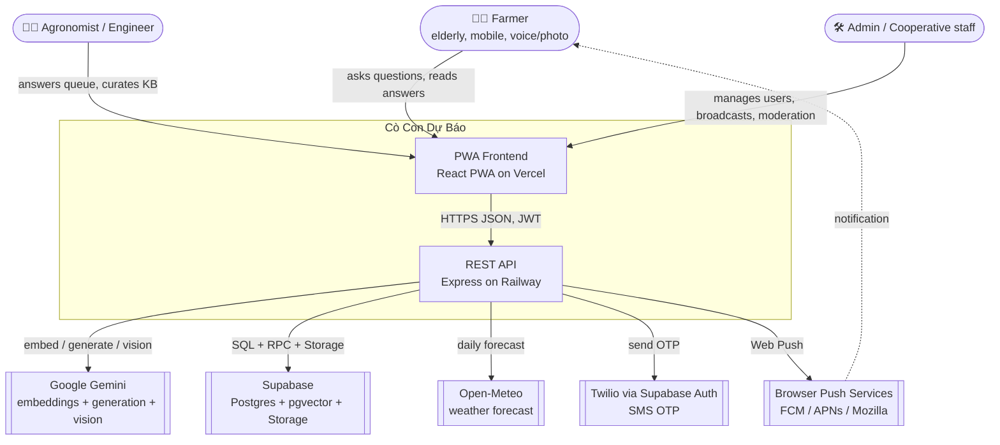
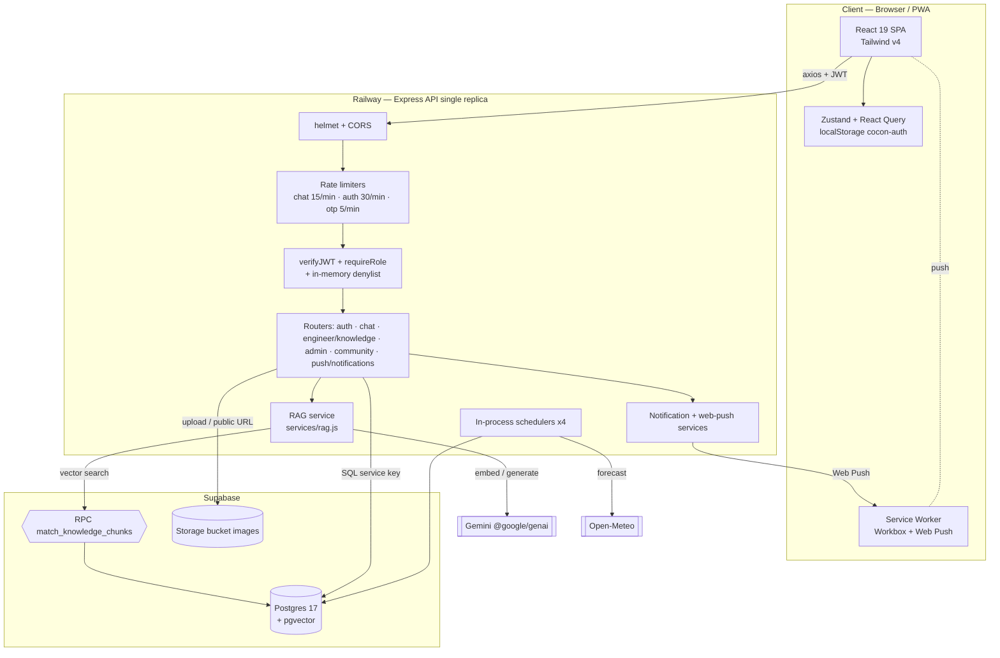
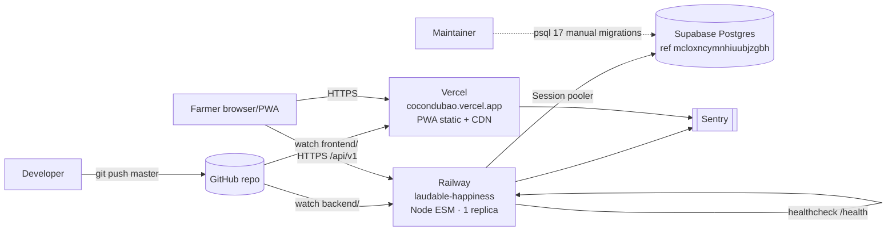
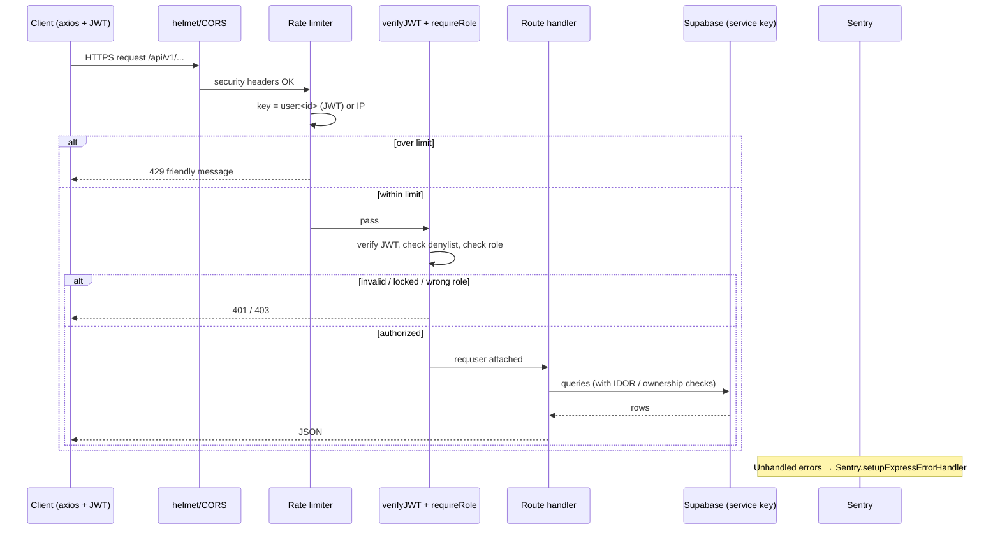
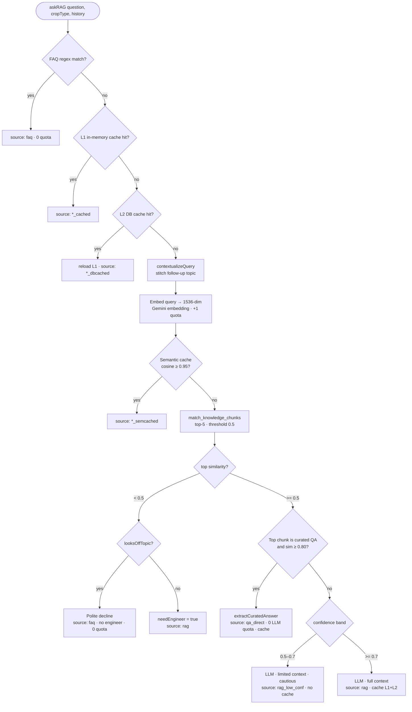
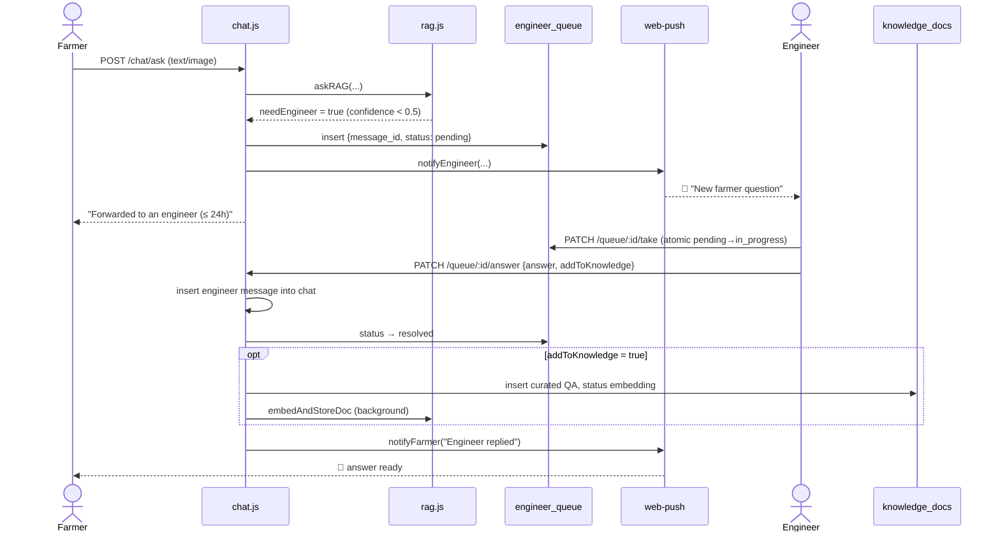

# Software Design Document (SDD) — Cò Con Dự Báo

> System Architecture & Technical Design

| Field | Value |
|---|---|
| **Document** | 03 — Software Design Document / System Architecture |
| **Product** | Cò Con Dự Báo — Agricultural advisory PWA |
| **Version** | 1.0.0 |
| **Status** | Baseline (reflects `master` @ 2026-06-30) |
| **Audience** | Engineers, technical reviewers, new contributors |
| **Related** | [02-SRS](02-SRS.md) · [04-DATABASE](04-DATABASE.md) · [05-API](05-API.md) · [07-RISK-REGISTER](07-RISK-REGISTER.md) · [OPERATIONS](../OPERATIONS.md) |

---

## Table of contents

1. [Abstract](#1-abstract)
2. [Architectural goals & constraints](#2-architectural-goals--constraints)
3. [System context (C4 L1)](#3-system-context-c4-level-1)
4. [Container view (C4 L2)](#4-container-view-c4-level-2)
5. [Deployment topology](#5-deployment-topology)
6. [Technology stack](#6-technology-stack)
7. [Backend architecture](#7-backend-architecture)
8. [The RAG subsystem](#8-the-rag-subsystem-core)
9. [Engineer escalation flow](#9-engineer-escalation-flow)
10. [Notification subsystem](#10-notification-subsystem)
11. [Frontend architecture](#11-frontend-architecture)
12. [Cross-cutting concerns](#12-cross-cutting-concerns)
13. [Scalability & the single-replica constraint](#13-scalability--the-single-replica-constraint)
14. [Architecture Decision Records (ADR)](#14-architecture-decision-records-adr)
15. [Diagram index](#15-diagram-index)

---

## 1. Abstract

**Cò Con Dự Báo** ("Little Stork Forecast") is a Progressive Web App (PWA) that gives
farmers in Trường Khánh commune (Sóc Trăng province, Vietnam) on-demand agricultural
advice. A farmer asks a question by text, voice, or photo; the system answers using a
**Retrieval-Augmented Generation (RAG)** pipeline backed by a curated agronomy
knowledge base, and **escalates hard questions to human agronomists** ("engineers").

The system is a two-package monorepo:

- **`frontend/`** — React 19 + Vite + Tailwind v4 PWA, deployed on **Vercel**.
- **`backend/`** — Express (ESM) REST API, deployed on **Railway** (single replica).
- **`supabase/`** — Postgres 17 + `pgvector` + Storage, the system of record.

External AI capability is provided by **Google Gemini** (`@google/genai`): one model
family for embeddings, one for text/vision generation.

The design optimizes for three forces that dominate every decision: (1) **end users are
elderly, low-literacy farmers on cheap phones in bright sunlight** → mobile-first,
high-contrast, voice/photo input, plain Vietnamese; (2) **Gemini free-tier quota is
extremely scarce** → a layered caching/short-circuit strategy that minimizes LLM calls;
(3) **a single backend replica** → all stateful concerns (cache, rate-limit, schedulers,
lockouts) are in-process and explicitly documented as such.

---

## 2. Architectural goals & constraints

### 2.1 Quality goals (prioritized)

| # | Goal | Why it dominates | Where it shows up |
|---|------|------------------|-------------------|
| 1 | **Cost / quota efficiency** | Gemini free tier ≈ tens of generate requests/day per model | FAQ short-circuit, 3-tier cache, `qa_direct` direct-serve, off-topic gate |
| 2 | **Usability for low-literacy users** | Primary persona is elderly farmers | Voice (STT/TTS), image diagnosis, plain language, large fonts |
| 3 | **Answer trustworthiness** | Wrong agronomy advice = real crop/financial damage | Confidence bands, human escalation, curated QA, disclaimers |
| 4 | **Security & privacy** | PII of villagers (phone, name, hamlet) | JWT + RBAC + RLS, IDOR checks, account denylist |
| 5 | **Operability** | Volunteer/solo maintenance | Sentry, `/health`, runbook, soft-degrade on missing tables |

### 2.2 Hard constraints

- **No Docker on the maintainer's machine** → migrations are applied manually with
  `psql` 17 against production; code must **degrade softly** when a table is missing.
- **Single Railway replica** → in-process scheduler/cache/rate-limit are correct *only*
  at one replica. Scaling out requires Redis + distributed locks (see §13).
- **Auto-deploy on `git push`** (Railway watches `backend/`, Vercel watches
  `frontend/`). No manual deploy step; a fix only reaches production after push.
- **Free-tier everything** (Railway, Vercel, Supabase, Gemini, Open-Meteo) — the
  architecture must keep request volume low and tolerate provider 429/503.

---

## 3. System context (C4 Level 1)

*(Placeholder: [Chèn ảnh sơ đồ từ mermaid.live vào đây])*

**Actors**

- **Farmer** — asks questions, uploads pest photos, reads answers, uses the community
  feed and weather, receives push notifications.
- **Engineer (agronomist)** — answers escalated questions, uploads/approves knowledge
  documents, authors curated Q&A, reviews AI answer quality.
- **Admin** — manages user accounts (lock/unlock, roles, PIN reset), broadcasts
  notifications, approves weather-alert drafts, moderates the community, views analytics.

**External systems**

- **Gemini** — embeddings (`gemini-embedding-001`, 1536-dim) and generation/vision
  (`gemini-2.5-flash`, `gemini-2.5-flash-lite` for STT).
- **Supabase** — Postgres 17 (system of record) with `pgvector`, plus an `images`
  Storage bucket.
- **Open-Meteo** — free daily forecast for the weather widget and weather-alert drafts.
- **Twilio** (via Supabase Auth) — SMS OTP for farmer phone verification (kept but
  flagged for replacement; Twilio deliverability is poor in Vietnam).
- **Browser push services** — deliver Web Push notifications.

---

## 4. Container view (C4 Level 2)

*(Placeholder: [Chèn ảnh sơ đồ từ mermaid.live vào đây])*

### 4.1 Module map (backend)

| Path | Responsibility |
|------|----------------|
| `backend/src/index.js` | App wiring: helmet, CORS, rate limiters, route mounts, `/health`, scheduler bootstrap, Sentry error handler |
| `backend/src/instrument.js` | Sentry init — imported **first** (ESM hoist) |
| `backend/src/middleware/auth.js` | `verifyJWT`, `requireRole`, in-memory account denylist + 60s sync poller |
| `backend/src/routes/auth.js` | Registration/login (phone+PIN, email+password), OTP, profile, account deletion |
| `backend/src/routes/chat.js` | Ask (text/image), STT fallback, escalate, error report, feedback, bookmarks, history |
| `backend/src/routes/engineer.js` | Engineer queue + knowledge base (upload/approve/embed/QA) — mounted at `/engineer` **and** `/knowledge` |
| `backend/src/routes/admin.js` | Users, stats, AI-error review, knowledge gaps, audit log, CSV export |
| `backend/src/routes/community.js` | Posts, comments, likes, content reports, admin moderation |
| `backend/src/routes/push.js` | Push subscribe/unsubscribe, broadcast send, scheduled & weather drafts, notification read/settings — mounted at `/push` **and** `/notifications` |
| `backend/src/services/rag.js` | The RAG pipeline (`askRAG`), embedding, splitter, caches, FAQ/off-topic gates, `embedAndStoreDoc` |
| `backend/src/services/notifications.js` | `dispatchNotification`, quiet-hours, scheduled-notification scheduler |
| `backend/src/services/webpush.js` | `notifyEngineer`, `notifyFarmer` |
| `backend/src/services/weatherAlerts.js` | Weather forecast evaluation → draft alerts for admin approval |
| `backend/src/services/storageCleanup.js` | Delete pest images > 30 days |
| `backend/src/services/quotaMonitor.js` | In-process Gemini RPM/RPD counter + 80% Sentry alert |
| `backend/src/services/supabase.js` | Supabase service-role client singleton |

---

## 5. Deployment topology

*(Placeholder: [Chèn ảnh sơ đồ từ mermaid.live vào đây])*

**Key facts**

- Both tiers **auto-deploy on `git push`** to `master`. There is no separate deploy
  command; production runs old code until a push + redeploy completes.
- The PWA's service worker caches aggressively → a new deploy does not reach an open
  session until a real reload. "Still broken after deploy" usually means stale SW cache.
- **Migrations are applied manually** by the maintainer with `psql` 17 over the Supabase
  Session pooler (no Docker → no `supabase db push`). Code is written to degrade softly
  when a not-yet-applied table is queried.
- Railway has `healthcheckPath: /health` configured (`railway.json`).
- Backend turns on production behavior (Sentry, etc.) only when `NODE_ENV=production` is
  set in Railway.

### 5.1 In-process schedulers (started in `index.js` on boot)

| Scheduler | Interval | Source | Purpose |
|-----------|----------|--------|---------|
| `startNotificationScheduler` | 60 s | `services/notifications.js` | Send scheduled notifications whose `scheduled_at <= now()` |
| `startUserStatusSync` | 60 s | `middleware/auth.js` | Refresh in-memory denylist of locked accounts from DB |
| `startWeatherAlertScheduler` | 6 h | `services/weatherAlerts.js` | Create weather-alert drafts for admin approval |
| `startStorageCleanupScheduler` | 24 h | `services/storageCleanup.js` | Delete pest images older than 30 days |

> ⚠️ All four are **in-process `setInterval` timers**, correct only at a single replica.
> The scheduled-notification loop guards against overlap with a `_processing` flag; a
> multi-replica deployment would double-send without a distributed lock (see §13).

---

## 6. Technology stack

### 6.1 Backend (`backend/package.json`)

| Concern | Choice | Notes |
|---------|--------|-------|
| Runtime | Node.js (ESM, `"type":"module"`) | |
| Web framework | Express 4 | `trust proxy = 1` (Railway is behind a reverse proxy) |
| AI SDK | `@google/genai` ^2.10 | Unified Google SDK; **required** for `thinkingConfig` (old `@google/generative-ai` 400s on prod) |
| DB / auth backend | `@supabase/supabase-js` ^2 | Service-role key for backend access |
| Auth tokens | `jsonwebtoken` | Self-signed JWT (7d email / 30d phone). **Not** Supabase Auth for sessions |
| Password hashing | `bcrypt` | cost 10 (create) / 12 (set/change) |
| Security headers | `helmet` | |
| Rate limiting | `express-rate-limit` ^8 | `ipKeyGenerator` for IPv6-safe IP fallback |
| File upload | `multer` (memory storage) | image / audio / document |
| Image processing | `sharp` | server-side re-encode + resize (also strips metadata) |
| DOCX/PDF extract | `mammoth` + `pdftotext` | KB ingestion |
| Web Push | `web-push` | VAPID |
| Error tracking | `@sentry/node` + profiling | gated on `NODE_ENV=production` |
| Tests | `vitest` + `supertest` | |

### 6.2 Frontend (`frontend/package.json`)

| Concern | Choice |
|---------|--------|
| UI | React 19 (React Compiler enabled) |
| Build | Vite 8 (Rolldown) |
| Styling | Tailwind CSS v4 (`@theme` design tokens) |
| PWA | `vite-plugin-pwa` + Workbox |
| Server state | `@tanstack/react-query` (staleTime 5 min) |
| Client state | `zustand` (persist key `cocon-auth`) |
| Routing | `react-router-dom` 7 |
| HTTP | `axios` (JWT interceptor, 45s/60s chat timeouts) |
| Icons | `lucide-react` + Material Symbols |
| Error tracking | `@sentry/react` (gated on `import.meta.env.PROD`) |
| Tests | `vitest` + Testing Library; `@playwright/test` for e2e |

### 6.3 Gemini models

| Use | Model | Config |
|-----|-------|--------|
| RAG answer generation | `gemini-2.5-flash` | `maxOutputTokens: 512`, `temperature: 0.2`, `thinkingBudget: 0` (thinking off → ~1.8 s vs ~6 s) |
| Vision (pest photo) | `gemini-2.5-flash` | `maxOutputTokens: 2048` — **shares the quota bucket** with RAG answers |
| Speech-to-text fallback | `gemini-2.5-flash-lite` | separate quota bucket |
| Embeddings | `gemini-embedding-001` | 1536-dim, sequential @ 700 ms/req; changing it requires full re-embed |

---

## 7. Backend architecture

### 7.1 Request lifecycle

*(Placeholder: [Chèn ảnh sơ đồ từ mermaid.live vào đây])*

### 7.2 Routing & dual-mount strategy

Routes are mounted under `/api/v1/*`. Two routers are mounted twice to give cleaner
URLs without duplicating code:

- `push.js` → `/api/v1/push` **and** `/api/v1/notifications`
- `engineer.js` → `/api/v1/engineer` **and** `/api/v1/knowledge`

Per-router middleware: `authLimiter` wraps `/auth`; `chatLimiter` wraps `/chat`. All
protected handlers call `verifyJWT` (and `requireRole(...)` where needed) individually.

### 7.3 Authentication & authorization (defense in depth)

Three independent layers protect data:

1. **JWT** (`verifyJWT`) — self-signed, carries `{ userId, phone, role, name }`. Bearer
   token in `Authorization`. Expiry 7 days (email accounts) / 30 days (phone accounts).
2. **In-memory denylist** — because tokens are long-lived, an admin lock must take effect
   before expiry. `markInactive`/`markActive` update a `Set<userId>` instantly; a 60 s
   poller (`refreshInactiveUsers`) re-syncs from `users.is_active` after restarts. A
   request from a locked user is rejected 401 even with a valid token.
3. **Role guard** (`requireRole`) — coarse RBAC at the route boundary.
4. **Row-Level Security (RLS)** — every table has RLS enabled. The backend uses the
   **service-role key (bypasses RLS)** and enforces ownership in code (IDOR checks);
   RLS is the backstop that denies any direct/anon client access. See [04-DATABASE](04-DATABASE.md).

**Per-resource ownership (IDOR) checks** are explicit in handlers, e.g. `isOwnSession`
(chat), `ownsMessage` (bookmarks/feedback), session-ownership on history, and "engineer
may only read a chat that was actually escalated".

### 7.4 Rate limiting (multi-tier)

| Limiter | Window | Limit | Key | Rationale |
|---------|--------|-------|-----|-----------|
| `chatLimiter` | 60 s | 15 | `user:<id>` else IP (`ipKeyGenerator`) | A whole commune behind one 4G NAT must not block each other |
| `authLimiter` | 60 s | 30 | IP | Several people logging in at once on shared NAT |
| `otpLimiter` | 60 s | 5 | IP | OTP send/verify abuse |
| PIN lockout | 10 min | 5 fails | phone | Brute-force protection on 6-digit PIN (in-memory) |

> The custom chat key generator must use `ipKeyGenerator(req.ip)` for the IP fallback —
> returning raw `req.ip` triggers `ERR_ERL_KEY_GEN_IPV6` on express-rate-limit v8.

---

## 8. The RAG subsystem (core)

`services/rag.js` is the heart of the product. `askRAG(question, cropType, history)`
is a **tiered pipeline** designed to answer correctly while calling Gemini as rarely as
possible. Each tier that resolves the question short-circuits the rest.

### 8.1 `askRAG` pipeline

*(Placeholder: [Chèn ảnh sơ đồ từ mermaid.live vào đây])*

### 8.2 Tiers explained (cheapest → most expensive)

| # | Tier | Cost | What it catches |
|---|------|------|-----------------|
| 0A | **FAQ** (`checkFAQ`) | 0 quota | Greetings, "who are you", thanks, filler ("vậy hả", "ờ") — regex |
| 0B | **L1 answer cache** (in-memory, TTL 1h, max 200) | 0 quota | Exact repeat questions within a process lifetime |
| 0C | **L2 DB cache** (`answer_cache` table) | 0 LLM | Repeat questions surviving redeploys (Railway redeploys often) |
| 1 | **Embed + semantic cache** | +1 embed | Same intent phrased differently (cosine ≥ 0.95) |
| 2 | **Vector search** (`match_knowledge_chunks`) | DB only | Retrieves top-5 chunks @ threshold 0.5 |
| 3 | **Off-topic gate** (`looksOffTopic`) | 0 quota | Non-agriculture questions below 0.5 → polite decline (no engineer) |
| 3.5 | **`qa_direct`** (`extractCuratedAnswer`) | 0 LLM | Curated "Câu trả lời:" chunk @ sim ≥ 0.80 → serve verbatim |
| 4 | **LLM generation** | +1 generate | Only when confidence ≥ 0.5 and no curated match |

### 8.3 Confidence bands (post-retrieval)

`confidence = top chunk cosine similarity`.

| Band | Behavior | `source` | Cached? |
|------|----------|----------|---------|
| `< 0.5` (off-topic) | Polite decline, no engineer | `faq` | no |
| `< 0.5` (agronomy) | **Escalate to engineer**, no LLM | `rag` (`needEngineer`) | no |
| `0.5 – 0.7` | LLM with limited context + caution note | `rag_low_conf` | no |
| `≥ 0.7` | LLM with full context | `rag` | **yes** (L1+L2) |
| any, curated hit ≥ 0.80 | Serve curated answer verbatim | `qa_direct` | yes |

### 8.4 Query contextualization & history

`contextualizeQuery` detects follow-up/elliptical questions ("còn cách khác", "đạo ôn
thì sao", ≤2 words) and prepends the last substantive farmer topic before embedding, so
retrieval doesn't drift off-topic. `buildMessages` enforces strict `user/model`
alternation required by the Gemini SDK (merging same-role turns, inserting a filler
model turn if needed).

### 8.5 Resilience

`invokeLLM` and `embedTexts` retry on **429 (quota)** and **503 (overloaded)**, parsing
`retry in Ns` from Gemini's message and adding exponential backoff + jitter. Vision
failures **fall back softly to text-only RAG**. The off-topic decline and FAQ tiers cost
zero quota by design. `quotaMonitor` counts RPM/RPD and emits a Sentry warning at 80%.

### 8.6 Knowledge ingestion (`embedAndStoreDoc`)

Engineers upload PDF/DOCX/TXT or author Q&A. On approval the document is chunked
(`splitTextRecursive`, ~1000 chars, 100 overlap), embedded sequentially, and stored in
`knowledge_chunks`. **Old chunks are replaced only after a successful embed** (delete +
insert window of a few ms) so a mid-way 429 never wipes a live document. Only docs with
`status = 'approved'` are visible to `match_knowledge_chunks`.

---

## 9. Engineer escalation flow

*(Placeholder: [Chèn ảnh sơ đồ từ mermaid.live vào đây])*

**Notes**

- `take` is **atomic** (`UPDATE ... WHERE status='pending'`) to avoid two engineers
  grabbing the same item; 0 rows updated → 409 Conflict.
- Editing a resolved answer **overwrites** the prior engineer message (matched by
  content) instead of appending a duplicate.
- A farmer can also **self-escalate** (`POST /chat/escalate`) after an AI answer, or
  **report an error** (👎) / mark **helpful** (👍). High-👍 answers become candidate
  curated QA. Deleting an unanswered queue item notifies the farmer so they don't wait
  in vain.

---

## 10. Notification subsystem

Three notification paths share `dispatchNotification` + `web-push`:

1. **Admin broadcast** (`POST /push/send`) — immediate or scheduled (`scheduled_at`).
2. **Scheduled delivery** — the 60 s scheduler sends due, unsent notifications.
3. **Weather-alert drafts** — `weatherAlerts.js` evaluates tomorrow's Open-Meteo forecast
   (rain ≥ 20 mm, heat ≥ 35 °C, wind ≥ 40 km/h, cold ≤ 18 °C) and inserts **drafts**
   (`type='weather', created_by=NULL`). Admin approves before any farmer is notified —
   the system never auto-sends weather alerts.

`dispatchNotification` filters subscribers by (a) opted-in `notif_types`, (b)
**quiet hours** (supports overnight windows like 22:00–06:00), and (c) crop targeting
(per-device `crops_filter`, falling back to profile `users.crops`). Expired
subscriptions (HTTP 410) are marked inactive automatically.

---

## 11. Frontend architecture

- **`services/api.js`** — all HTTP grouped into objects (`authAPI`, `chatAPI`, `pushAPI`,
  `engineerAPI`, `communityAPI`, `adminAPI`). An axios interceptor attaches the JWT from
  `localStorage['cocon-auth']` and redirects to `/login` on 401. Chat uses long timeouts
  (45 s text / 60 s image) because the LLM may retry.
- **State** — Zustand stores (`authStore` persisted as `cocon-auth`, plus `displayStore`,
  `templateStore`, `toastStore`) + React Query (5-minute staleTime) for server state.
- **Routing** (`App.jsx`) — `ProtectedRoute` guards token + `allowedRoles`. Farmer pages
  import eagerly; engineer/admin pages are `lazy()`. Public routes: `/`, `/login`,
  `/policies`, `/weather`. Staff pages live inside a `DesktopLayout` (sidebar); farmer
  pages are mobile-first standalone.
- **Answer rendering** — `components/AnswerContent.jsx` renders markdown and appends a
  one-line "consult an engineer" disclaimer for technical answers (`source` not
  faq/engineer). The system prompt deliberately omits the disclaimer so the frontend
  controls it.
- **Hooks** — `useWeather` (Open-Meteo, 429 fallback), `useSTT`/`useTTS` (voice),
  `usePush` (Web Push subscribe). iOS Safari STT falls back to the backend
  `/chat/stt-fallback` endpoint.
- **PWA** — Workbox service worker; on SW update the app auto-reloads. Client-side image
  compression (`utils/compressImage.js`) before upload. Vendor chunk splitting keeps the
  entry bundle small (~137 KB).

### 11.1 Design system

The brand and tokens are documented separately in [design.md](../design.md): primary
brown `#4B230A`, warm cream surface `#fdf8f5`, large type, high contrast, wide touch
targets — all driven by the elderly-farmer persona. Read-content zoom uses a
`--read-scale` CSS variable (never whole-page zoom).

---

## 12. Cross-cutting concerns

| Concern | Approach |
|---------|----------|
| **Observability** | Sentry on both tiers (sampling 0.1, no Replay), gated on production; user context `{id, role}` attached in `verifyJWT`; `/health` endpoint for uptime checks |
| **Quota monitoring** | `quotaMonitor` counts every Gemini call (RPM/RPD), warns to Sentry at 80% |
| **Error handling** | Uniform 500 messages to clients (no DB internals leaked); friendly 429 copy on quota; soft-degrade (`isMissingTable`) when a migration isn't applied yet |
| **Input safety** | `sharp` re-encodes all images (strips EXIF/metadata); PostgREST `.or()` filter injection stripped; CSV formula injection neutralized on export; crop whitelist; length caps; no `dangerouslySetInnerHTML` |
| **Secrets** | All via env vars (`GOOGLE_API_KEY`, `JWT_SECRET`, VAPID keys, Supabase keys); none committed |
| **Privacy** | Account deletion soft-disables + nulls PII and removes uploaded images, preserving FK history |
| **Disaster Recovery** | Point-in-Time Recovery via Supabase dashboard; manual DB restore in case of accidental table drops. |

---

## 13. Scalability & the single-replica constraint

The current design is correct and cost-optimal **at one replica**. The following are
in-process and would need externalizing to scale horizontally:

| In-process today | Problem at N replicas | Target |
|------------------|-----------------------|--------|
| L1 answer cache + semantic cache | per-replica, lower hit rate | Redis (L2 `answer_cache` already cross-replica) |
| Chat/auth rate limiters | per-replica counters | Redis store for `express-rate-limit` |
| PIN lockout + account denylist | per-replica state | Redis / shared store |
| 4× `setInterval` schedulers | duplicate sends/work | Leader election via Postgres advisory lock or a queue |
| pgvector `ivfflat (lists=100)` | fine at pilot scale | tune lists / upgrade index as KB grows |

The definitive fix for Gemini 429s is enabling **billing** on the Gemini account (a
business decision), not model swaps. See [07-RISK-REGISTER](07-RISK-REGISTER.md) and
[IMPROVEMENTS.md](../IMPROVEMENTS.md) for the prioritized backlog.

---

## 14. Architecture Decision Records (ADR)

| ID | Decision | Status | Rationale / consequence |
|----|----------|--------|-------------------------|
| ADR-01 | Self-signed JWT, **not** Supabase Auth, for sessions | Accepted | Full control over phone+PIN flow; requires manual denylist for instant lockout |
| ADR-02 | Backend uses Supabase **service-role key**; RLS as backstop | Accepted | Simpler server logic; ownership enforced in code; RLS denies anon/direct access |
| ADR-03 | Tiered cache + curated `qa_direct` to minimize LLM calls | Accepted | Survives scarce free-tier quota; adds cache-invalidation considerations |
| ADR-04 | In-process schedulers/cache/limits (single replica) | Accepted (constrained) | Zero infra cost now; explicit migration path to Redis/locks before scaling |
| ADR-05 | Migrate to `@google/genai`, disable thinking | Accepted | `thinkingConfig` only works on the unified SDK; ~1.8 s vs ~6 s; old SDK 400s on prod |
| ADR-06 | Manual `psql` migrations + soft-degrade on missing tables | Accepted | No Docker locally; run `psql` on `supabase/migrations/*.sql` |
| ADR-07 | Weather alerts are drafts requiring admin approval | Accepted | Avoids false/spam alerts to elderly users; adds an admin step |
| ADR-08 | Removed LangChain (incl. splitter) in favor of native SDK + hand-written splitter | Accepted | Fewer deps, faster cold start; must maintain `splitTextRecursive` |
| ADR-09 | Keep OTP/Twilio code but flag for replacement | Accepted | Twilio SMS deliverability poor in VN; provider swap deferred |
| ADR-10 | Replaced Supabase Realtime (engineer queue) with polling | Accepted | Anon Realtime blocked by RLS; polling pauses on hidden tab |

---

## 15. Diagram index

| # | Diagram | Section |
|---|---------|---------|
| 1 | System context (C4 L1) | [§3](#3-system-context-c4-level-1) |
| 2 | Container view (C4 L2) | [§4](#4-container-view-c4-level-2) |
| 3 | Deployment topology | [§5](#5-deployment-topology) |
| 4 | Request lifecycle (sequence) | [§7.1](#71-request-lifecycle) |
| 5 | RAG pipeline (flowchart) | [§8.1](#81-askrag-pipeline) |
| 6 | Engineer escalation (sequence) | [§9](#9-engineer-escalation-flow) |

An **ERD** and a **use-case diagram** live in [04-DATABASE](04-DATABASE.md) and
[02-SRS](02-SRS.md) respectively, to keep each diagram next to its detailed text.

---

*Maintained alongside the code. When architecture changes, update this file and note the
date/author per the repository convention in `AI-CONTEXT.md`.*
