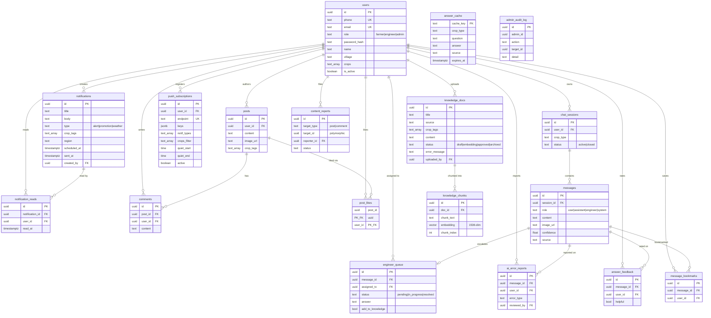

# Database Design & Data Dictionary — Cò Con Dự Báo

| Field | Value |
|---|---|
| **Document** | 04 — Database Design & Data Dictionary |
| **Engine** | PostgreSQL 17 (Supabase, project ref `mcloxncymnhiuubjzgbh`) |
| **Extensions** | `pgvector` (vector similarity) |
| **Version** | 1.0.0 |
| **Status** | Baseline (reflects `supabase/migrations/*` @ 2026-06-30) |
| **Source of truth** | `supabase/migrations/*.sql` — this document **describes**, the migrations **define** |
| **Related** | [03-ARCHITECTURE](03-ARCHITECTURE.md) · [05-API](05-API.md) · [02-SRS](02-SRS.md) |

---

## Table of contents

1. [Overview & conventions](#1-overview--conventions)
2. [Entity-Relationship Diagram (ERD)](#2-entity-relationship-diagram-erd)
3. [Domain groupings](#3-domain-groupings)
4. [Data dictionary](#4-data-dictionary)
   - [4.1 users](#41-users)
   - [4.2 chat_sessions](#42-chat_sessions)
   - [4.3 messages](#43-messages)
   - [4.4 engineer_queue](#44-engineer_queue)
   - [4.5 knowledge_docs](#45-knowledge_docs)
   - [4.6 knowledge_chunks](#46-knowledge_chunks)
   - [4.7 answer_cache](#47-answer_cache)
   - [4.8 ai_error_reports](#48-ai_error_reports)
   - [4.9 answer_feedback](#49-answer_feedback)
   - [4.10 message_bookmarks](#410-message_bookmarks)
   - [4.11 notifications](#411-notifications)
   - [4.12 notification_reads](#412-notification_reads)
   - [4.13 push_subscriptions](#413-push_subscriptions)
   - [4.14 posts](#414-posts)
   - [4.15 comments](#415-comments)
   - [4.16 post_likes](#416-post_likes)
   - [4.17 content_reports](#417-content_reports)
   - [4.18 admin_audit_log](#418-admin_audit_log)
5. [Functions & RPC](#5-functions--rpc)
6. [Triggers](#6-triggers)
7. [Indexes](#7-indexes)
8. [Row-Level Security (RLS)](#8-row-level-security-rls)
9. [Storage](#9-storage-buckets)
10. [Referential integrity & deletion behavior](#10-referential-integrity--deletion-behavior)
11. [Migration history](#11-migration-history)

---

## 1. Overview & conventions

- **18 tables** in schema `public`, grouped into five domains (§3).
- **Primary keys** are `uuid` defaulted by `gen_random_uuid()`, except `post_likes`
  (composite `post_id, user_id`) and `answer_cache` (`cache_key text`).
- **Timestamps** are `timestamptz` (`timestamp with time zone`), defaulting to `now()`.
- **Crop tags** are Postgres `text[]` arrays; the valid crop vocabulary is
  `{rice, veggie, fruit, other}` (enforced in application code, not by DB CHECK).
- **Enums vs Checks:** The design uses `TEXT` columns with `CHECK` constraints (e.g., `status IN ('pending', 'resolved')`) instead of PostgreSQL `ENUM` types. This makes future migrations much easier without running complex `ALTER TYPE` statements.
- **Embeddings** are `vector(1536)` (must match the Gemini embedding dimension; changing
  the embedding model requires re-embedding all chunks).
- **RLS is enabled on every table.** The backend connects with the Supabase
  **service-role key** (bypasses RLS) and enforces authorization in application code; RLS
  is the backstop that denies anon/direct client access (see §8).
- Several tables are added by later migrations and are queried with **soft-degrade**
  (the API returns an "unavailable" flag instead of 500 when a table is not yet applied):
  `answer_cache`, `message_bookmarks`, `admin_audit_log`.

Legend for the dictionary: **PK** primary key · **FK** foreign key · **UK** unique ·
**NN** not null.

---

## 2. Entity-Relationship Diagram (ERD)



*(Placeholder: [Chèn ảnh sơ đồ từ mermaid.live vào đây])*


> **Polymorphic relationship:** `content_reports.target_id` points to either `posts.id`
> or `comments.id` depending on `target_type`. There is **no DB foreign key** for it;
> application code cleans up orphaned reports when a post/comment is deleted.
> `admin_audit_log` columns are intentionally loose (denormalized names stored inline) so
> the log survives without joins — no enforced FKs.

---

## 3. Domain groupings

| Domain | Tables |
|--------|--------|
| **Identity & access** | `users` |
| **Conversational AI** | `chat_sessions`, `messages`, `engineer_queue`, `ai_error_reports`, `answer_feedback`, `message_bookmarks` |
| **Knowledge base (RAG)** | `knowledge_docs`, `knowledge_chunks`, `answer_cache` |
| **Notifications** | `notifications`, `notification_reads`, `push_subscriptions` |
| **Community** | `posts`, `comments`, `post_likes`, `content_reports` |
| **Administration** | `admin_audit_log` |

---

## 4. Data dictionary

### 4.1 `users`

Every account: farmers (phone + PIN), engineers/admins (email + password). RLS policy
`users_self` (`auth.uid() = id`).

| Column | Type | Null | Default | Constraints | Description |
|--------|------|------|---------|-------------|-------------|
| `id` | uuid | NN | `gen_random_uuid()` | **PK** | Account id |
| `phone` | text | nullable | — | **UK** | E.164 phone (`+84...`); farmers |
| `email` | text | nullable | — | **UK** | Lowercased; engineers/admins |
| `role` | text | NN | `'farmer'` | CHECK in `{farmer, engineer, admin}` | RBAC role |
| `password_hash` | text | nullable | — | — | bcrypt hash (PIN for farmers, password for staff) |
| `name` | text | nullable | — | — | Display name; null ⇒ "new user" prompt |
| `village` | text | nullable | — | — | Hamlet/commune |
| `crops` | text[] | nullable | `'{}'` | — | Subset of `{rice,veggie,fruit,other}` |
| `is_active` | boolean | nullable | `true` | — | `false` ⇒ locked / self-deleted (denylist) |
| `created_at` | timestamptz | nullable | `now()` | — | |
| `updated_at` | timestamptz | nullable | `now()` | — | Maintained by `trg_users_updated_at` |

### 4.2 `chat_sessions`

One advisory conversation. RLS policy `sessions_owner` (`user_id = auth.uid()`).

| Column | Type | Null | Default | Constraints | Description |
|--------|------|------|---------|-------------|-------------|
| `id` | uuid | NN | `gen_random_uuid()` | **PK** | |
| `user_id` | uuid | nullable | — | **FK** → `users(id)` ON DELETE CASCADE | Owner farmer |
| `crop_type` | text | nullable | — | — | Crop context for RAG filtering |
| `status` | text | nullable | `'active'` | CHECK in `{active, closed}` | |
| `created_at` | timestamptz | nullable | `now()` | — | |

### 4.3 `messages`

Every turn in a conversation (farmer, AI, engineer, or system). RLS policy
`messages_owner` (session belongs to `auth.uid()`).

| Column | Type | Null | Default | Constraints | Description |
|--------|------|------|---------|-------------|-------------|
| `id` | uuid | NN | `gen_random_uuid()` | **PK** | |
| `session_id` | uuid | nullable | — | **FK** → `chat_sessions(id)` ON DELETE CASCADE | |
| `role` | text | NN | — | CHECK in `{user, assistant, engineer, system}` | Author kind |
| `content` | text | NN | — | — | Message text |
| `image_url` | text | nullable | — | — | Pest photo public URL (nulled when image purged) |
| `confidence` | double precision | nullable | — | — | RAG similarity (assistant messages) |
| `source` | text | nullable | — | CHECK in `{rag, llm, engineer}` | Origin of an answer |
| `created_at` | timestamptz | nullable | `now()` | — | |

> Note: the application also uses logical `source` values like `faq`, `qa_direct`,
> `vision`, `rag_low_conf` in API responses; the DB CHECK only constrains stored values
> to `{rag, llm, engineer}`, so persisted `source` is normalized accordingly.

### 4.4 `engineer_queue`

Questions escalated to human agronomists. RLS enabled, no policy (service-role only).

| Column | Type | Null | Default | Constraints | Description |
|--------|------|------|---------|-------------|-------------|
| `id` | uuid | NN | `gen_random_uuid()` | **PK** | |
| `message_id` | uuid | nullable | — | **FK** → `messages(id)` ON DELETE CASCADE | The farmer's question |
| `assigned_to` | uuid | nullable | — | **FK** → `users(id)` | Engineer who took it |
| `status` | text | nullable | `'pending'` | CHECK in `{pending, in_progress, resolved}` | |
| `answer` | text | nullable | — | — | Engineer's answer text |
| `add_to_knowledge` | boolean | nullable | `false` | — | If true ⇒ answer becomes curated QA |
| `created_at` | timestamptz | nullable | `now()` | — | |
| `resolved_at` | timestamptz | nullable | — | — | Set on resolve |

### 4.5 `knowledge_docs`

Source documents/QA for the RAG knowledge base. RLS policy `knowledge_farmer_read`
(approved docs are world-readable; staff see all).

| Column | Type | Null | Default | Constraints | Description |
|--------|------|------|---------|-------------|-------------|
| `id` | uuid | NN | `gen_random_uuid()` | **PK** | |
| `title` | text | NN | — | — | Document title |
| `source` | text | nullable | — | — | `engineer_answer` / `manual_qa` / `ai_review` / `ai_error_fix` / filename |
| `crop_tags` | text[] | nullable | `'{}'` | — | Crop scoping |
| `content` | text | nullable | — | — | Full extracted text |
| `status` | text | nullable | `'draft'` | CHECK in `{draft, embedding, approved, archived}` | Lifecycle |
| `uploaded_by` | uuid | nullable | — | **FK** → `users(id)` | Author |
| `version` | integer | nullable | `1` | — | |
| `error_message` | text | nullable | — | — | Embed failure reason (UI banner) |
| `created_at` | timestamptz | nullable | `now()` | — | |
| `updated_at` | timestamptz | nullable | `now()` | — | |

> Only `status = 'approved'` docs are searchable (enforced inside
> `match_knowledge_chunks`). `embedding` is a transient state while chunks are computed.

### 4.6 `knowledge_chunks`

Embedded text chunks for vector search. RLS enabled, no policy (service-role only).

| Column | Type | Null | Default | Constraints | Description |
|--------|------|------|---------|-------------|-------------|
| `id` | uuid | NN | `gen_random_uuid()` | **PK** | |
| `doc_id` | uuid | nullable | — | **FK** → `knowledge_docs(id)` ON DELETE CASCADE | Parent doc |
| `chunk_text` | text | NN | — | — | ~1000-char chunk |
| `embedding` | vector(1536) | nullable | — | ivfflat cosine index | Gemini embedding |
| `chunk_index` | integer | nullable | — | — | Order within doc |
| `created_at` | timestamptz | nullable | `now()` | — | |

### 4.7 `answer_cache`

Durable L2 answer cache (survives redeploys) to cut Gemini calls. Soft-degraded.

| Column | Type | Null | Default | Constraints | Description |
|--------|------|------|---------|-------------|-------------|
| `cache_key` | text | NN | — | **PK** | `"<crop|*>::<normalized question>"` |
| `crop_type` | text | nullable | — | — | |
| `question` | text | nullable | — | — | Original question |
| `answer` | text | NN | — | — | Cached answer |
| `confidence` | real | nullable | — | — | |
| `source` | text | nullable | — | — | `rag` / `qa_direct` |
| `created_at` | timestamptz | NN | `now()` | — | |
| `expires_at` | timestamptz | NN | — | — | TTL (≈ 1 hour) |

### 4.8 `ai_error_reports`

Farmer "this answer is wrong" reports (👎). RLS: insert own (`user_id = auth.uid()`);
engineers/admins read.

| Column | Type | Null | Default | Constraints | Description |
|--------|------|------|---------|-------------|-------------|
| `id` | uuid | NN | `gen_random_uuid()` | **PK** | |
| `message_id` | uuid | nullable | — | **FK** → `messages(id)` ON DELETE CASCADE | Reported answer |
| `user_id` | uuid | nullable | — | **FK** → `users(id)` | Reporter |
| `error_type` | text | NN | — | CHECK in `{wrong_info, irrelevant, hard_to_understand}` | |
| `note` | text | nullable | — | — | Optional detail |
| `reviewed_by` | uuid | nullable | — | **FK** → `users(id)` | Admin who handled it |
| `created_at` | timestamptz | nullable | `now()` | — | |

### 4.9 `answer_feedback`

Positive feedback (👍). RLS enabled, no policy (service-role only).

| Column | Type | Null | Default | Constraints | Description |
|--------|------|------|---------|-------------|-------------|
| `id` | uuid | NN | `gen_random_uuid()` | **PK** | |
| `message_id` | uuid | NN | — | **FK** → `messages(id)` ON DELETE CASCADE | |
| `user_id` | uuid | NN | — | **FK** → `users(id)` ON DELETE CASCADE | |
| `helpful` | boolean | NN | — | — | `true` = 👍 |
| `created_at` | timestamptz | NN | `now()` | — | |
| | | | | **UK** (`message_id`, `user_id`) | One vote per user per answer (upsertable) |

### 4.10 `message_bookmarks`

Farmer-saved answers. RLS enabled, no policy. Soft-degraded.

| Column | Type | Null | Default | Constraints | Description |
|--------|------|------|---------|-------------|-------------|
| `id` | uuid | NN | `gen_random_uuid()` | **PK** | |
| `message_id` | uuid | NN | — | **FK** → `messages(id)` ON DELETE CASCADE | |
| `user_id` | uuid | NN | — | **FK** → `users(id)` ON DELETE CASCADE | |
| `created_at` | timestamptz | NN | `now()` | — | |
| | | | | **UK** (`message_id`, `user_id`) | One bookmark per user per answer |

### 4.11 `notifications`

Broadcast notifications and weather-alert drafts. RLS policy `notif_read` (crop-matched
or general).

| Column | Type | Null | Default | Constraints | Description |
|--------|------|------|---------|-------------|-------------|
| `id` | uuid | NN | `gen_random_uuid()` | **PK** | |
| `title` | text | NN | — | — | |
| `body` | text | NN | — | — | |
| `type` | text | NN | — | CHECK in `{alert, promotion, weather}` | |
| `image_url` | text | nullable | — | — | Illustration |
| `crop_tags` | text[] | nullable | `'{}'` | — | Empty ⇒ general; else crop-targeted |
| `region` | text | nullable | — | — | Weather dedup key `wx:<kind>:<date>` (not shown to farmers) |
| `scheduled_at` | timestamptz | nullable | — | — | Set ⇒ scheduled; scheduler sends when due |
| `sent_at` | timestamptz | nullable | — | — | Null + scheduled ⇒ pending; null + `created_by` null + type weather ⇒ draft |
| `created_by` | uuid | nullable | — | **FK** → `users(id)` | Null ⇒ system-generated draft |
| `created_at` | timestamptz | nullable | `now()` | — | |

> The `notifications` table encodes three lifecycles via `created_by`/`scheduled_at`/
> `sent_at`: **immediate** (`sent_at` set), **scheduled** (`scheduled_at` set, `sent_at`
> null), **weather draft** (`type=weather`, `created_by` null, all timestamps null).

### 4.12 `notification_reads`

Per-user read receipts. RLS enabled.

| Column | Type | Null | Default | Constraints | Description |
|--------|------|------|---------|-------------|-------------|
| `id` | uuid | NN | `gen_random_uuid()` | **PK** | |
| `notification_id` | uuid | nullable | — | **FK** → `notifications(id)` ON DELETE CASCADE | |
| `user_id` | uuid | nullable | — | **FK** → `users(id)` ON DELETE CASCADE | |
| `read_at` | timestamptz | nullable | `now()` | — | |
| | | | | **UK** (`notification_id`, `user_id`) | One receipt per user per notification |

### 4.13 `push_subscriptions`

Web Push endpoints + per-device notification preferences. RLS enabled.

| Column | Type | Null | Default | Constraints | Description |
|--------|------|------|---------|-------------|-------------|
| `id` | uuid | NN | `gen_random_uuid()` | **PK** | |
| `user_id` | uuid | nullable | — | **FK** → `users(id)` ON DELETE CASCADE | |
| `endpoint` | text | NN | — | **UK** | Push endpoint URL |
| `keys` | jsonb | NN | — | — | `{p256dh, auth}` |
| `crops_filter` | text[] | nullable | `'{}'` | — | Per-device crop filter |
| `notif_types` | text[] | nullable | `'{alert,promotion,weather}'` | — | Opted-in types |
| `quiet_start` | time | nullable | `'22:00:00'` | — | Quiet-hours start |
| `quiet_end` | time | nullable | `'06:00:00'` | — | Quiet-hours end |
| `active` | boolean | nullable | `true` | — | `false` ⇒ unsubscribed / expired (410) |
| `created_at` | timestamptz | nullable | `now()` | — | |

### 4.14 `posts`

Community feed posts. RLS enabled.

| Column | Type | Null | Default | Constraints | Description |
|--------|------|------|---------|-------------|-------------|
| `id` | uuid | NN | `gen_random_uuid()` | **PK** | |
| `user_id` | uuid | NN | — | **FK** → `users(id)` ON DELETE CASCADE | Author |
| `content` | text | NN | — | CHECK length 1–1000 | |
| `image_url` | text | nullable | — | — | |
| `crop_tags` | text[] | nullable | `'{}'` | — | |
| `created_at` | timestamptz | NN | `now()` | — | |

### 4.15 `comments`

Comments on posts. RLS enabled.

| Column | Type | Null | Default | Constraints | Description |
|--------|------|------|---------|-------------|-------------|
| `id` | uuid | NN | `gen_random_uuid()` | **PK** | |
| `post_id` | uuid | NN | — | **FK** → `posts(id)` ON DELETE CASCADE | |
| `user_id` | uuid | NN | — | **FK** → `users(id)` ON DELETE CASCADE | |
| `content` | text | NN | — | CHECK length 1–500 | |
| `created_at` | timestamptz | NN | `now()` | — | |

### 4.16 `post_likes`

Like join table (composite PK — naturally idempotent). RLS enabled.

| Column | Type | Null | Default | Constraints | Description |
|--------|------|------|---------|-------------|-------------|
| `post_id` | uuid | NN | — | **PK**, **FK** → `posts(id)` ON DELETE CASCADE | |
| `user_id` | uuid | NN | — | **PK**, **FK** → `users(id)` ON DELETE CASCADE | |
| `created_at` | timestamptz | nullable | `now()` | — | |

### 4.17 `content_reports`

Farmer reports of bad posts/comments; admin moderates. RLS enabled, no policy.

| Column | Type | Null | Default | Constraints | Description |
|--------|------|------|---------|-------------|-------------|
| `id` | uuid | NN | `gen_random_uuid()` | **PK** | |
| `target_type` | text | NN | — | CHECK in `{post, comment}` | Polymorphic discriminator |
| `target_id` | uuid | NN | — | *(no FK — polymorphic)* | Reported post/comment id |
| `reporter_id` | uuid | NN | — | **FK** → `users(id)` ON DELETE CASCADE | |
| `reason` | text | nullable | — | — | Optional (≤ 300 chars in app) |
| `status` | text | NN | `'pending'` | CHECK in `{pending, reviewed, dismissed}` | |
| `created_at` | timestamptz | NN | `now()` | — | |
| `reviewed_by` | uuid | nullable | — | — | Admin |
| `reviewed_at` | timestamptz | nullable | — | — | |
| | | | | **UK** (`target_type`, `target_id`, `reporter_id`) | One report per user per item |

### 4.18 `admin_audit_log`

Immutable-ish log of admin actions. RLS enabled, no policy (service-role only).

| Column | Type | Null | Default | Constraints | Description |
|--------|------|------|---------|-------------|-------------|
| `id` | uuid | NN | `gen_random_uuid()` | **PK** | |
| `admin_id` | uuid | nullable | — | *(no FK)* | Acting admin |
| `admin_name` | text | nullable | — | — | Denormalized for display |
| `action` | text | NN | — | — | `lock_user`/`unlock_user`/`change_role`/`reset_pin`/`create_staff` |
| `target_id` | uuid | nullable | — | *(no FK)* | Affected entity |
| `target_name` | text | nullable | — | — | Denormalized |
| `detail` | text | nullable | — | — | Human-readable detail |
| `created_at` | timestamptz | nullable | `now()` | — | |

---

## 5. Functions & RPC

### `match_knowledge_chunks(query_embedding, match_threshold=0.5, match_count=5, filter_crop=NULL)`

The vector-search RPC powering RAG retrieval. Returns
`TABLE(id uuid, chunk_text text, similarity double precision, doc_id uuid)`.

```sql
SELECT kc.id, kc.chunk_text,
       1 - (kc.embedding <=> query_embedding) AS similarity,
       kc.doc_id
FROM knowledge_chunks kc
JOIN knowledge_docs   kd ON kc.doc_id = kd.id
WHERE kd.status = 'approved'
  AND (filter_crop IS NULL OR filter_crop = ANY(kd.crop_tags))
  AND 1 - (kc.embedding <=> query_embedding) > match_threshold
ORDER BY kc.embedding <=> query_embedding
LIMIT match_count;
```

- Uses cosine distance (`<=>`); `similarity = 1 - distance`.
- **Only `approved` docs** participate; optional crop filter narrows by `crop_tags`.

### `update_updated_at()`

Trigger function: `NEW.updated_at = now(); RETURN NEW;`.

---

## 6. Triggers

| Trigger | Table | Timing | Function | Purpose |
|---------|-------|--------|----------|---------|
| `trg_users_updated_at` | `users` | BEFORE UPDATE FOR EACH ROW | `update_updated_at()` | Refresh `updated_at` |

---

## 7. Indexes

| Index | Table | Definition | Purpose |
|-------|-------|------------|---------|
| `knowledge_chunks_embedding_idx` | `knowledge_chunks` | ivfflat (`vector_cosine_ops`) `lists=100` | Vector ANN search |
| `idx_chunks_doc_id` | `knowledge_chunks` | btree (`doc_id`) | Chunk-by-doc lookup / re-embed |
| `idx_docs_status_crop` | `knowledge_docs` | btree (`status`, `crop_tags`) | Doc listing & filtering |
| `idx_messages_session` | `messages` | btree (`session_id`, `created_at`) | Conversation fetch |
| `idx_queue_status` | `engineer_queue` | btree (`status`, `created_at`) | Queue listing |
| `idx_sessions_user` | `chat_sessions` | btree (`user_id`, `created_at DESC`) | History |
| `idx_users_phone` | `users` | btree (`phone`) | Login lookup |
| `idx_users_role` | `users` | btree (`role`) | Role filters / staff fan-out |
| `comments_post_id_created_at_idx` | `comments` | btree (`post_id`, `created_at`) | Comment thread |
| `post_likes_user_id_idx` | `post_likes` | btree (`user_id`) | "liked by me" |
| `posts_created_at_idx` | `posts` | btree (`created_at DESC`) | Feed |
| `idx_notifications_pending_schedule` | `notifications` | btree (`scheduled_at`) WHERE `sent_at IS NULL` | Scheduler scan |
| `idx_content_reports_pending` | `content_reports` | btree (`created_at`) WHERE `status='pending'` | Moderation queue |
| `idx_answer_feedback_message` | `answer_feedback` | btree (`message_id`) | 👍 counts |
| `idx_message_bookmarks_user` | `message_bookmarks` | btree (`user_id`, `created_at DESC`) | Saved list |
| `answer_cache_expires_idx` | `answer_cache` | btree (`expires_at`) | TTL sweeping |
| `idx_admin_audit_created` | `admin_audit_log` | btree (`created_at DESC`) | Audit listing |

---

## 8. Row-Level Security (RLS)

**Every table has RLS enabled.** The backend uses the service-role key (which bypasses
RLS), so application code is the primary authorization layer; RLS is a defense-in-depth
backstop that blocks anon/`authenticated` clients from reading data directly. Policies
that *do* exist (for any future direct-client access):

| Table | Policy | Effect |
|-------|--------|--------|
| `users` | `users_self` | A user can only access their own row (`auth.uid() = id`) |
| `chat_sessions` | `sessions_owner` | Owner only (`user_id = auth.uid()`) |
| `messages` | `messages_owner` (SELECT) | Only messages in the user's own sessions |
| `knowledge_docs` | `knowledge_farmer_read` (SELECT) | Approved docs world-readable; staff see all |
| `notifications` | `notif_read` (SELECT) | General (`crop_tags={}`) or crop-matched to user |
| `ai_error_reports` | `ai_error_insert` / `ai_error_read_eng` | Insert own; engineers/admins read |

Tables with **RLS on but no policy** (deny-all to clients; service-role only):
`engineer_queue`, `knowledge_chunks`, `post_likes`, `posts`, `comments`,
`push_subscriptions`, `notification_reads`, `answer_feedback`, `message_bookmarks`,
`content_reports`, `answer_cache`, `admin_audit_log`.

> **Consequence:** Supabase Realtime cannot subscribe to `engineer_queue` from an anon
> client (RLS blocks it), which is why the engineer queue uses **polling** rather than
> Realtime (see ADR-10 in [03-ARCHITECTURE](03-ARCHITECTURE.md)).

---

## 9. Storage (buckets)

| Bucket | Folder convention | Used by | Lifecycle |
|--------|-------------------|---------|-----------|
| `images` | `pest-images/<userId>/<ts>.jpg` | Chat pest photos | Auto-deleted after 30 days (`storageCleanup.js`); `messages.image_url` nulled |
| `images` | `community/<userId>/<ts>.jpg` | Community post images | Kept; removed when post/account deleted |
| `images` | `notifications/<userId>/<ts>.jpg` | Admin notification illustrations | Kept |

Public-read bucket; object paths use UUIDs/timestamps (hard to guess). All images are
re-encoded by `sharp` on upload (resize + strip metadata).

---

## 10. Referential integrity & deletion behavior

- **CASCADE deletes** flow from `users` → sessions → messages → (queue, error reports,
  feedback, bookmarks), and `posts` → (comments, post_likes). Deleting a `knowledge_docs`
  cascades to its `knowledge_chunks`.
- **Soft delete for accounts:** `DELETE /auth/account` does **not** hard-delete the user
  row (which would break chat/report history FKs). It sets `is_active=false`, nulls PII
  (`name`, `village`, `crops`), deactivates push subscriptions, and removes the user's
  uploaded images.
- **Restrictive FKs (no cascade):** `engineer_queue.assigned_to`,
  `knowledge_docs.uploaded_by`, `notifications.created_by`, `ai_error_reports.reviewed_by`
  reference `users(id)` without cascade (these are staff references that should persist).
- **Polymorphic cleanup:** deleting a post/comment triggers an application-level delete of
  matching `content_reports` rows (no DB cascade for the polymorphic target).

---

## 11. Migration history

Applied manually via `psql` 17 against production (no Docker → no `supabase db push`),
then committed. Files in `supabase/migrations/`:

| Timestamp | File | Adds |
|-----------|------|------|
| 20260603182216 | `remote_schema.sql` | Base schema: 13 tables, RPC, trigger, indexes, RLS |
| 20260603195915 | `add_notifications_scheduled_at.sql` | `notifications.scheduled_at` + partial index |
| 20260606000000 | `enable_rls_push_notification_reads.sql` | RLS on push/notification_reads |
| 20260612090000 | `knowledge_docs_embedding_error.sql` | `error_message` column + `embedding` status |
| 20260615000000 | `admin_audit_log.sql` | `admin_audit_log` table |
| 20260621000000 | `answer_feedback.sql` | `answer_feedback` table (👍) |
| 20260621000001 | `content_reports.sql` | `content_reports` table (moderation) |
| 20260628000000 | `answer_cache.sql` | `answer_cache` table (L2 cache) |
| 20260629000000 | `message_bookmarks.sql` | `message_bookmarks` table |

> When adding a migration: create the file in `supabase/migrations/`, apply by hand with
> `psql`, then commit. Vector columns are `vector(1536)`. Write API code to degrade
> softly so a deploy that precedes the manual migration does not 500.

**Seed Data (Tạo Admin đầu tiên):**
Để khởi tạo hệ thống sau khi tạo database mới, bạn cần tạo ít nhất 1 tài khoản `admin`. Hãy chạy file `seed.sql` (nếu có) hoặc tự INSERT thủ công vào bảng `users` với `role = 'admin'`.
