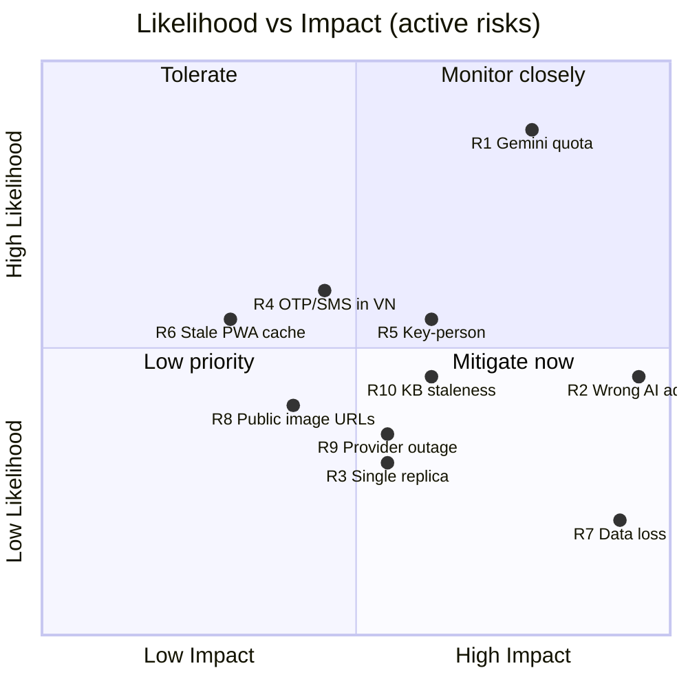

# Risk Register — Cò Con Dự Báo

| Field | Value |
|---|---|
| **Document** | 07 — Risk Register & Mitigation Plan |
| **Version** | 1.0.0 |
| **Status** | Living document (baseline 2026-06-30) |
| **Related** | [01-PROJECT-CHARTER](01-PROJECT-CHARTER.md) · [03-ARCHITECTURE](03-ARCHITECTURE.md) · [06-TEST-PLAN](06-TEST-PLAN.md) · [IMPROVEMENTS.md](../IMPROVEMENTS.md) · [OPERATIONS.md](../OPERATIONS.md) |

> This register tracks **forward-looking risks** to the product. The historical defect
> backlog (IDs G1–J3, mostly resolved) lives in [IMPROVEMENTS.md](../IMPROVEMENTS.md);
> §6 here summarizes which classes of those have been mitigated. Operational procedures
> (backup, monitoring, quota) are in [OPERATIONS.md](../OPERATIONS.md).

---

## Table of contents

1. [Scoring method](#1-scoring-method)
2. [Risk heat map](#2-risk-heat-map)
3. [Active risk register](#3-active-risk-register)
4. [Detailed risk cards](#4-detailed-risk-cards)
5. [Accepted / residual risks](#5-accepted--residual-risks)
6. [Mitigated risk classes (historical)](#6-mitigated-risk-classes-historical)
7. [Risk monitoring & review](#7-risk-monitoring--review)

---

## 1. Scoring method

Each risk is scored on **Likelihood (L)** × **Impact (I)**, each 1–5; **Score = L × I**.

| Likelihood | Meaning | Impact | Meaning |
|------------|---------|--------|---------|
| 1 Rare | Unlikely in pilot | 1 Negligible | Cosmetic |
| 2 Unlikely | Could happen | 2 Minor | Small, recoverable |
| 3 Possible | Even odds over time | 3 Moderate | Noticeable disruption |
| 4 Likely | Expected | 4 Major | Core function impaired / data risk |
| 5 Almost certain | Recurring | 5 Severe | Crop/financial harm, breach, data loss |

**Severity bands:** 🟢 Low 1–6 · 🟡 Medium 8–12 · 🟠 High 15–16 · 🔴 Critical 20–25.

**Response strategies:** Mitigate · Accept · Transfer · Avoid.

---

## 2. Risk heat map

*(Placeholder: [Chèn ảnh sơ đồ từ mermaid.live vào đây])*

---

## 3. Active risk register

| ID | Risk | Category | L | I | Score | Band | Strategy | Owner | Status | Next Review |
|----|------|----------|---|---|-------|------|----------|-------|--------|-------------|
| R1 | Gemini free-tier quota exhaustion (429) | Technical / Cost | 4 | 4 | 16 | 🟠 High | Mitigate | Dev | Open (mitigated, billing pending) | 2026-07-30 |
| R2 | Incorrect / unsafe AI advice | Product / Safety | 2 | 5 | 10 | 🟡 Med | Mitigate | Dev + Engineers | Open (controls in place) | 2026-07-30 |
| R3 | Single-replica scaling ceiling | Architecture | 2 | 3 | 6 | 🟢 Low | Accept (planned) | Dev | Open (path documented) | 2026-12-31 |
| R4 | OTP/SMS deliverability in Vietnam | Onboarding | 3 | 3 | 9 | 🟡 Med | Mitigate/Transfer | Dev | Open (PIN primary) | 2026-07-30 |
| R5 | Key-person dependence (solo maintainer) | Organizational | 3 | 4 | 12 | 🟡 Med | Mitigate | Sponsor + Dev | Open | 2026-09-30 |
| R6 | Stale PWA service-worker cache after deploy | Operational | 2 | 3 | 6 | 🟢 Low | Mitigate | Dev | Mitigated | 2026-12-31 |
| R7 | Data loss (Postgres / knowledge base) | Data | 2 | 5 | 10 | 🟡 Med | Mitigate/Transfer | Dev | Open (runbook) | 2026-07-30 |
| R8 | Public image URLs leak sensitive photos | Privacy | 2 | 3 | 6 | 🟢 Low | Accept (monitored) | Dev | Accepted | 2026-12-31 |
| R9 | Third-party provider outage (Gemini/Supabase/Vercel/Railway) | Dependency | 3 | 3 | 9 | 🟡 Med | Mitigate/Transfer | Dev | Open | 2026-07-30 |
| R10 | Knowledge-base staleness / thin coverage | Product | 3 | 3 | 9 | 🟡 Med | Mitigate | Engineers | Open | 2026-07-30 |
| R11 | Multi-replica double-send / race (if scaled without locks) | Architecture | 2 | 3 | 6 | 🟢 Low | Avoid (until locks) | Dev | Open | 2026-12-31 |
| R12 | Prompt injection via user content | Security | 2 | 2 | 4 | 🟢 Low | Accept (narrow blast radius) | Dev | Accepted | 2026-12-31 |
| R13 | Adoption / usability shortfall (elderly users) | Product | 3 | 4 | 12 | 🟡 Med | Mitigate | Dev + Sponsor | Open | 2026-08-30 |
| R14 | Cost escalation if usage grows beyond free tier | Cost | 2 | 3 | 6 | 🟢 Low | Monitor | Dev | Open | 2026-08-30 |

---

## 4. Detailed risk cards

### R1 — Gemini free-tier quota exhaustion (🟠 16)
- **Description:** The free tier allows only ~tens of generate requests/day per model
  bucket; vision shares the bucket with RAG answers. At peak, answers can fail with 429.
- **Triggers:** spike in questions; many photo questions; cache cold after redeploy.
- **Mitigation (in place):** FAQ short-circuit; off-topic gate; L1 + durable L2 + semantic
  caches; curated `qa_direct` (0 LLM); thinking disabled; retry with backoff on 429/503;
  `quotaMonitor` warns at 80% RPM/RPD via Sentry; friendly user-facing 429 copy.
- **Definitive fix:** enable **Gemini billing** (business decision) — the only true
  removal of the cap. Tracked in [Charter §11](01-PROJECT-CHARTER.md#11-budget--resources).
- **Contingency:** during outages, low-confidence questions still escalate to engineers.

### R2 — Incorrect / unsafe AI advice (🟡 10, high impact)
- **Description:** Wrong disease ID or dosage can cause real crop/financial loss.
- **Mitigation:** RAG grounding in approved KB; confidence bands (escalate < 0.5, caution
  0.5–0.7); human escalation; curated QA reviewed by engineers; "consult an engineer"
  disclaimer on technical answers; vision-uncertainty → escalate; the **RAG eval suite**
  (`backend/eval/`) gates prompt/model/threshold changes; 👎 reports feed corrections.
- **Residual:** rare confident-but-wrong answers in the 0.5–0.7 band. **Open action A:**
  author *differential* QA for ambiguous symptoms (yellow leaf/wilt/spots).

### R3 — Single-replica scaling ceiling (🟢 6)
- **Description:** In-process cache/rate-limit/schedulers are correct at one replica only.
- **Mitigation/plan:** documented migration path — Redis for cache/limits/lockout,
  Postgres advisory-lock leader election for schedulers, pgvector index tuning
  ([Architecture §13](03-ARCHITECTURE.md#13-scalability--the-single-replica-constraint)).
- **Strategy:** accept for pilot; revisit before onboarding multiple communes.

### R4 — OTP/SMS deliverability in Vietnam (🟡 9)
- **Description:** Twilio SMS deliverability is poor in VN, hurting phone verification.
- **Mitigation:** phone + **PIN** is the primary auth path (OTP optional); provider swap
  planned. **Transfer** component: delivery depends on the SMS provider.

### R5 — Key-person dependence (🟡 12)
- **Description:** A solo maintainer is a single point of failure for build/run/ops.
- **Mitigation:** this documentation suite, `OPERATIONS.md` runbook, `CLAUDE.md`/
  `AI-CONTEXT.md`, automated tests, Sentry — all lower the bus-factor and onboarding cost.
- **Open action:** recruit/transfer knowledge to a second maintainer.

### R6 — Stale PWA service-worker cache (🟢 6, mitigated)
- **Description:** A new deploy doesn't reach an open session until a real reload.
- **Mitigation:** auto-reload on SW update; behavior documented; "still broken after
  deploy" is a known false alarm (old cached code).

### R7 — Data loss (🟡 10, high impact)
- **Description:** Loss of `users`/`messages`/`knowledge_chunks` would be catastrophic.
- **Mitigation:** Supabase managed Postgres with point-in-time recovery; backup/restore
  procedure documented in [OPERATIONS.md](../OPERATIONS.md) (PITR + `pg_dump`).
- **Transfer:** relies on Supabase durability. **Open action:** verify a periodic
  off-platform `pg_dump` export.

### R8 — Public image URLs (🟢 6, accepted)
- **Description:** The `images` bucket is public; anyone with a link can view a pest/
  community photo. Paths use UUIDs/timestamps (hard to guess).
- **Decision:** accepted for pilot (low sensitivity, hard-to-enumerate paths); pest images
  auto-purge after 30 days. Revisit with signed URLs if sensitivity increases.

### R9 — Third-party provider outage (🟡 9)
- **Description:** Gemini/Supabase/Vercel/Railway/Open-Meteo outages degrade the service.
- **Mitigation:** retries on transient AI errors; weather 429 fallback; Sentry alerting;
  `/health` monitoring. **Transfer:** SLAs of providers; mostly outside our control.

### R10 — Knowledge-base staleness / thin coverage (🟡 9)
- **Description:** Thin/outdated KB → more escalations and weaker answers.
- **Mitigation:** engineer answers can be promoted to curated QA; admin "knowledge gaps"
  view surfaces low-confidence questions; 👍/👎 review loop; ingestion of new documents.
- **Owner action:** engineers continuously curate; expand the eval `dataset.json`.

### R11 — Multi-replica double-send / race (🟢 6)
- **Description:** Scaling beyond one replica without distributed locks would double-send
  scheduled notifications and duplicate scheduler work.
- **Strategy:** **avoid** scaling out until leader election is added (advisory lock/queue).

### R12 — Prompt injection (🟢 4, accepted)
- **Description:** Malicious user text could try to steer the LLM.
- **Assessment (security review):** narrow blast radius — the model only sees the user's
  own conversation and retrieved public KB; no cross-user data exposure. Accepted.

### R13 — Adoption / usability shortfall (🟡 12)
- **Description:** Elderly, low-literacy users may struggle, limiting adoption/value.
- **Mitigation:** voice & photo input, plain Southern-Vietnamese, large adjustable text,
  high contrast, minimal steps; user manuals + training guide (`docs/HUONG-DAN-*`).
- **Open action:** structured UAT and field training with the cooperative.

### R14 — Cost escalation beyond free tier (🟢 6)
- **Description:** Growth could push Gemini/Supabase/Railway past free limits.
- **Mitigation:** caching minimizes AI calls; quota monitoring; cost is a planned,
  controllable upgrade (billing) rather than a surprise.

---

## 5. Accepted / residual risks

These are explicitly **accepted** for the pilot (from the 2026-06-30 security review and
design decisions), to be revisited as scale/sensitivity grows:

| Item | Why accepted | Revisit trigger |
|------|--------------|-----------------|
| `/admin/sentry-test` route effectively unreachable (missing `verifyJWT` → 401) | Harmless; not a data path | If converted to a real admin route |
| Public image bucket (UUID paths) | Low sensitivity; pest images auto-purge 30d | Higher-sensitivity media; complaints |
| Farmer JWT valid 30 days | Denylist + 60s poller block locked accounts promptly | Stronger session revocation needs |
| Prompt injection | Narrow blast radius (own chat + public KB) | Any cross-user data in prompts |
| No automated load/stress testing | Pilot scale (tens of users) | Approaching scale-out |

---

## 6. Mitigated risk classes (historical)

The risk-first backlog (IDs G1–J3 in [IMPROVEMENTS.md](../IMPROVEMENTS.md)) has already
**closed** entire classes of risk; summarized so reviewers see what is *no longer* open:

| Class | Examples (IDs) | Outcome |
|-------|----------------|---------|
| Broken push/notifications | G1, G4, G5, H5 | Push handler restored, brand icons, correct deep-links, no welcome spam |
| Account-lock latency | G2 | Instant denylist + 60s poller |
| Authorization / IDOR | H1, H2, chat ownership checks | Session/message ownership enforced; role-appropriate password strength |
| Account enumeration | G8 | OTP response no longer leaks existence/role |
| Injection | J1 (CSV), `.or()` stripping | Formula & PostgREST filter injection neutralized |
| Quota / cost | G10, H10, H12 | Semantic + L2 cache, SDK migration, thinking off |
| Data hygiene / storage | G9, H15 | Image cleanup on delete + 30-day pest-image purge |
| Dependency vulns | I5 | 2 high vite dev-server vulns fixed; 0 vuln |
| Observability gap | G15, J3 | Sentry both tiers; `/health`; runbook |
| Dead Realtime (silent failure) | I1 | Replaced with polling |

---

## 7. Risk monitoring & review

- **Cadence:** review this register at each work "wave" and when adding a major feature.
- **Signals watched:** Sentry errors; `quotaMonitor` 80% alerts; admin dashboard
  (`overdueQueue`, `ragRate`, knowledge gaps); 👎 report volume; `/health` uptime.
- **Updates:** when a risk changes status, update the row and note date/owner per the
  repository convention in `AI-CONTEXT.md`. New defects go to `IMPROVEMENTS.md`; new
  forward risks go here.
- **Escalation:** 🔴/🟠 risks are addressed before feature expansion, consistent with the
  project's "risks first, features later" principle.
